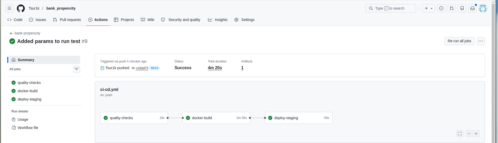
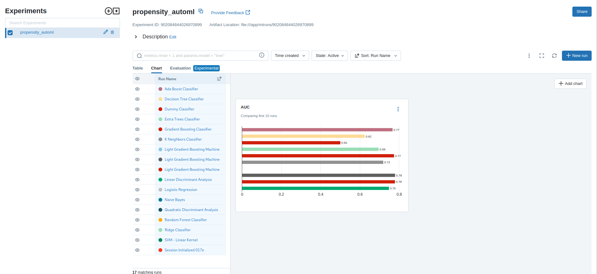

# Customer Propensity Modeling: Bank Marketing Campaign
Цуркан Владислав. Учебный проект по дисциплине «Автоматизация машинного обучения»

1. Описание бизнес-задачи
Проблема: Банки тратят значительные ресурсы на массовые обзвоны клиентов. Конверсия в оформление срочного вклада составляет ~11%, что приводит к высоким операционным затратам и риску оттока из-за спама.
Цель: Раздать автоматизированную ML-систему для скоринга склонности клиента к отклику. Ранжирование базы позволяет таргетировать только перспективных лидов.

### Схема пайплайна
CSV → ETL (очистка, leakage control) → обработанные данные → AutoML (PyCaret) → финальная модель → оценка → MLflow

### ETL
- Extract: чтение bank-additional-full.csv (41 188 записей, 21 колонка).
- Transform:
Удалён признак duration (утечка данных: недоступен до завершения звонка).
Целевая переменная y закодирована: no → 0, yes → 1.
Пропуски обрабатываются автоматически внутри PyCaret (SimpleImputer).
- Load: данные передаются напрямую в pycaret

### Архитектура ML-модели
Использована библиотека PyCaret (классификация). Автоматически протестировано 15+ моделей (LightGBM, XGBoost, CatBoost, Random Forest и др.). Лучшая модель отбирается по ROC-AUC. Дисбаланс классов (отклик ≈ 11.3%) устранён встроенным SMOTE.

### Метрики на тестовой выборке (20 % данных)

| Метрика           | Значение   |
|-------------------|------------|
| Accuracy          | 0.8712     |
| F1                | 0.4603     |
| Recall            | 0.4873     |
| Precision         | 0.4362     |
| ROC-AUC           | 0.7788     |

## 2. Автоматизация обучения (AutoML)

**Используемый метод:** PyCaret

**Автоматизированные этапы:**
- Предобработка: масштабирование, кодирование, восполнение пропусков.
- Сравнение 15+ моделей по ROC_AUC с кросс-валидацией.
- Автоматическая балансировка классов (SMOTE) и отбор признаков.
- Настройка гиперпараметров лучшей модели.
- Финальное дообучение на всех данных.
- Сохранение модели и логов в MLflow.

Код: `src/train.py`.

---

## 3. Тестирование

Реализованы модульные тесты с использованием pytest:

- **Валидация конфига** – проверка парсинга pipeline.yaml и значений по умолчанию.
- **Контроль утечек** – проверка удаления признака duration до обучения.
- **Кодирование цели** – проверка маппинга y: {no→0, yes→1}.
- **Интеграционный тест** – проверка оркестрации пайплайна (mock PyCaret для скорости CI).

---

## 4. Контейнеризация (Docker)

**Dockerfile** основан на `python:3.10`.  

**Функции контейнеризации:**
- **Воспроизводимость:** идентичное окружение на любой машине.
- **Изоляция:** отсутствие конфликтов зависимостей.
- **Безопасность:** минимальный базовый образ, отсутствие лишних инструментов.
- **Ресурсы:** возможность ограничения CPU/памяти при запуске.

--- 

## 5. CI/CD

**Непрерывная интеграция** реализована через GitHub Actions (`.github/workflows/ci.yml`).

При каждом push в main/develop или Pull Request выполняются:
- Установка Python 3.10 и uv.
- Синхронизация зависимостей (uv sync --frozen).
- Линтинг (ruff, black --check), проверка типов (mypy).
- Прогон тестов с отчётом покрытия (pytest --cov).
- Сборка Docker-образа и smoke-тест импорта.

## 6. Мониторинг

### Качество модели (MLflow)
Все эксперименты автоматически логируются в MLflow: метрики, параметры, артефакты.

Во время обучения в Docker-контейнере отслеживалась загрузка CPU и потребление памяти.

